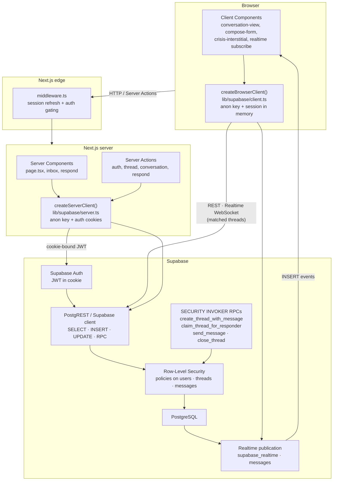

# Paw2Paw

**Status:** MVP in dev — production deploy in progress.

Paw2Paw is an anonymous peer-support messaging platform for Princeton students. Marginalized students and communities — first-gen, neurodivergent, students of color, student-athletes, LGBTQ+, international, diabetic, disabled — get less mental health support at elite institutions because everyone assumes they have enough help. Paw2Paw works to pair students for one-to-one conversations with crisis resources always one tap away.

**Live demo:** coming soon — URL and Loom walkthrough will be added after deploy.

## Documentation

- Full walkthrough: [docs/codebase-walkthrough.md](docs/codebase-walkthrough.md) (includes Tech Stack Glossary as Part 8)
- Glossary shortcut: [docs/glossary.md](docs/glossary.md)

## Architecture



Trust boundaries and interview notes: [docs/architecture.md](docs/architecture.md).

## Tech stack

| Layer | Choice | Version |
|-------|--------|---------|
| Framework | Next.js (App Router) | 16.2.7 |
| Language | TypeScript (strict) | ^5 |
| UI | Tailwind CSS | ^4 |
| Auth + DB + Realtime | Supabase (`@supabase/ssr`, `@supabase/supabase-js`) | ^0.10.3 / ^2.107.0 |
| ORM / migrations | Drizzle ORM + Drizzle Kit | ^0.45.2 / ^0.31.10 |
| Validation | Zod | ^4.4.3 |
| Runtime | React | 19.2.4 |
| Deploy target | Vercel | — |

## Local setup

1. Clone the repo and `cd paw2paw`
2. `pnpm install`
3. `cp .env.local.example .env.local` — fill in Supabase project URL (base URL, **no** `/rest/v1/`), publishable key, pooler URLs, and `SIGN_DISPLAY_ID_SECRET`
4. `pnpm db:migrate`
5. `pnpm dev` → [http://localhost:3000](http://localhost:3000)

For local E2E testing, disable **Confirm email** in Supabase (Auth → Providers → Email). Re-enable before production deploy and verify confirmation email templates.

## Project structure

```
app/           # Routes, Server Components, Client Components, Server Actions
lib/           # Supabase clients, auth, copy, validations, crisis, db schema
docs/          # Architecture, security, decisions, E2E checklist, roadmap
drizzle/       # SQL migrations (RLS, RPCs, realtime) — schema source of truth
```

## Roadmap

Resume and shipping priorities: [docs/roadmap-resume.md](docs/roadmap-resume.md).

## Security

Threat model, RLS summary, and responsible disclosure: [SECURITY.md](SECURITY.md).

## License

MIT — see [LICENSE](LICENSE).
