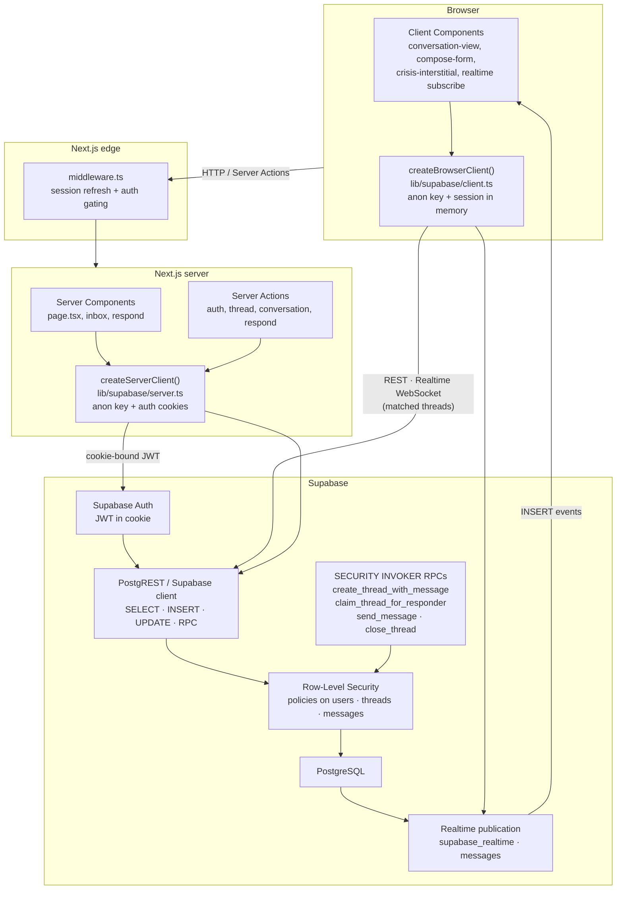

# Architecture

## Trust boundaries

**Client → server.** The browser holds only the publishable anon key and the user’s session cookie. Client Components may call Server Actions or the browser Supabase client; they never receive `SIGN_DISPLAY_ID_SECRET`, service-role keys, or direct Postgres URLs. Middleware refreshes the session and redirects unauthenticated or onboarding-incomplete users before protected routes render.

**Server → database (RLS enforced).** Every query and RPC runs as the authenticated user (`auth.uid()`), not as a privileged application role. Authorization is enforced in Postgres policies and `SECURITY INVOKER` functions — the Next.js layer validates input (Zod) and maps errors, but does not decide who can read a thread or flag a message. A leaked anon key still cannot bypass RLS without a valid user JWT.

**Database → realtime broadcast.** The `messages` table is on the `supabase_realtime` publication (migration `0009`). Inserts that pass RLS are broadcast to subscribed clients on `conversation:{threadId}`. Subscribers still only receive rows their JWT could have selected; realtime does not widen access beyond existing SELECT policies.
