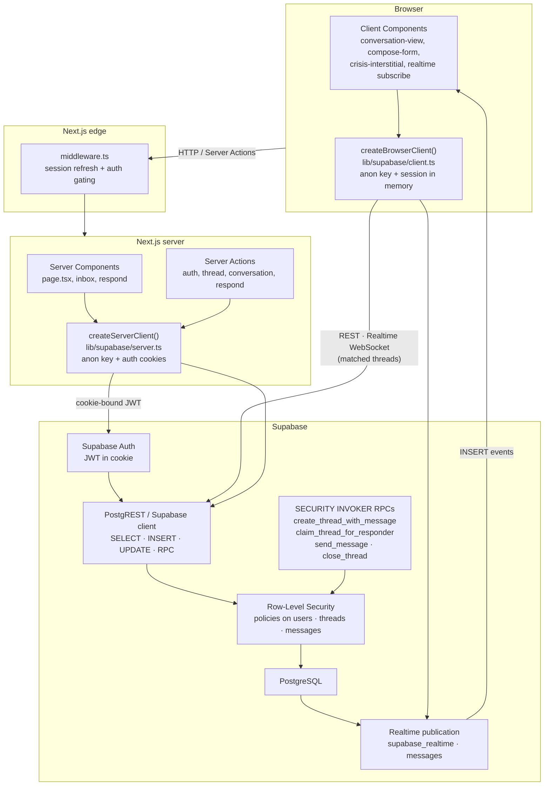

# Architecture

Package and platform definitions: [codebase-full-index-glossary.md — Part 5](./codebase-full-index-glossary.md#part-5--tech-stack-glossary).

Terms in the diagram — [Next.js](codebase-full-index-glossary.md#nextjs), [React](codebase-full-index-glossary.md#react), [@supabase/supabase-js](codebase-full-index-glossary.md#supabasesupabase-js), [Supabase](codebase-full-index-glossary.md#supabase), [PostgreSQL](codebase-full-index-glossary.md#postgresql), [Row-Level Security (RLS)](codebase-full-index-glossary.md#row-level-security-rls), and Supabase Realtime (see [Realtime](codebase-full-index-glossary.md#realtime)) — are defined in [Part 5 of the codebase full index / glossary](codebase-full-index-glossary.md#part-5--tech-stack-glossary).

## Trust boundaries

**Client → server.** The browser holds only the publishable anon key and the user’s session cookie. [Client Components](codebase-full-index-glossary.md#nextjs) may call Server Actions or the browser [Supabase](codebase-full-index-glossary.md#supabase) client ([@supabase/supabase-js](codebase-full-index-glossary.md#supabasesupabase-js)); they never receive `SIGN_DISPLAY_ID_SECRET`, service-role keys, or direct Postgres URLs. Middleware refreshes the session and redirects unauthenticated or onboarding-incomplete users before protected routes render.

**Server → database (RLS enforced).** Every query and RPC runs as the authenticated user (`auth.uid()`), not as a privileged application role. Authorization is enforced in [PostgreSQL](codebase-full-index-glossary.md#postgresql) policies and `SECURITY INVOKER` functions — [Row-Level Security (RLS)](codebase-full-index-glossary.md#row-level-security-rls) is the source of truth; the [Next.js](codebase-full-index-glossary.md#nextjs) layer validates input ([Zod](codebase-full-index-glossary.md#zod)) and maps errors, but does not decide who can read a thread or flag a message. A leaked anon key still cannot bypass RLS without a valid user JWT.

**Database → realtime broadcast.** The `messages` table is on the `supabase_realtime` publication (migration `0009`). Inserts that pass RLS are broadcast to subscribed clients on `conversation:{threadId}`. Subscribers still only receive rows their JWT could have selected; Supabase Realtime (see [Realtime](codebase-full-index-glossary.md#realtime)) does not widen access beyond existing SELECT policies.
